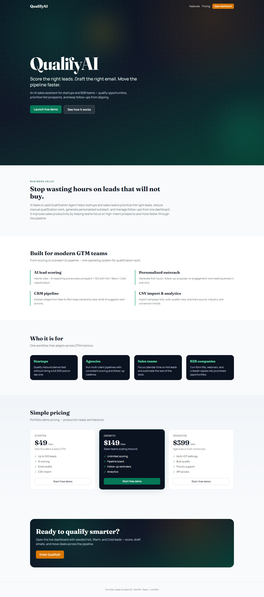
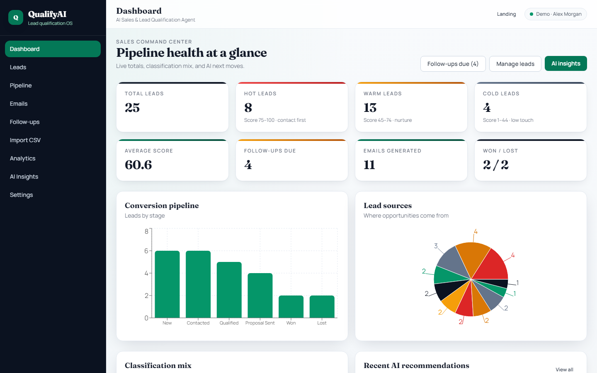
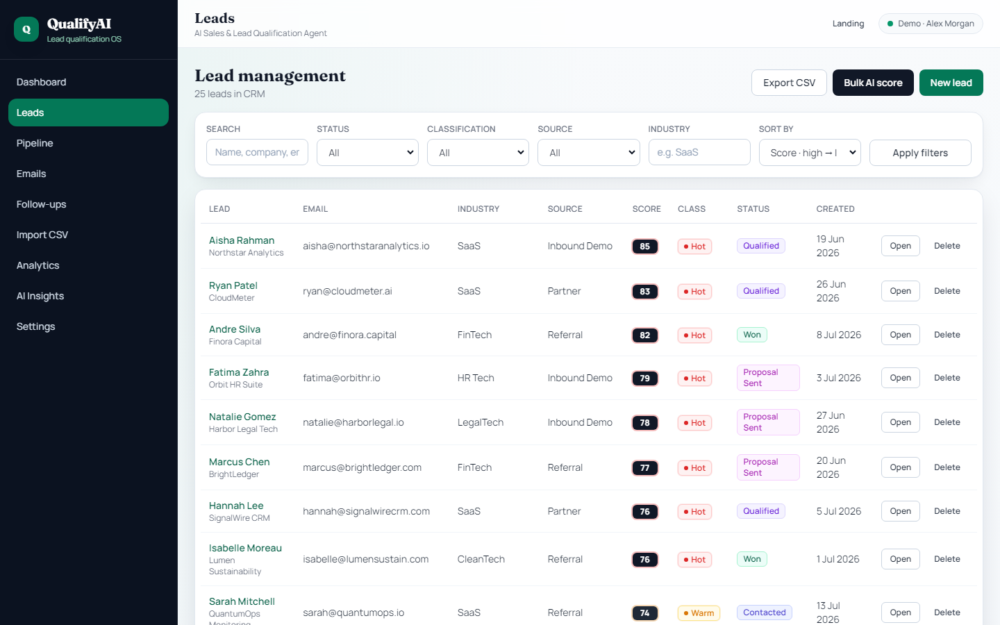
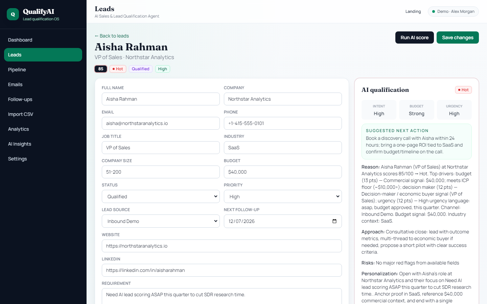
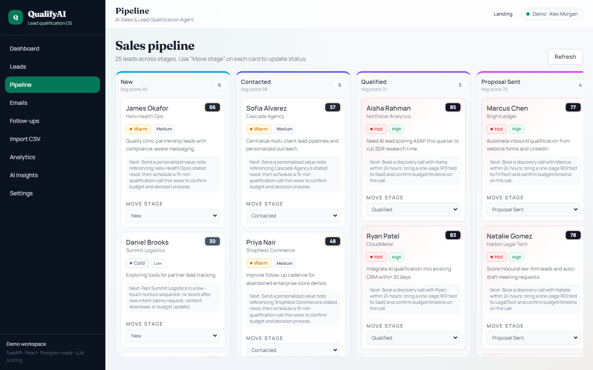
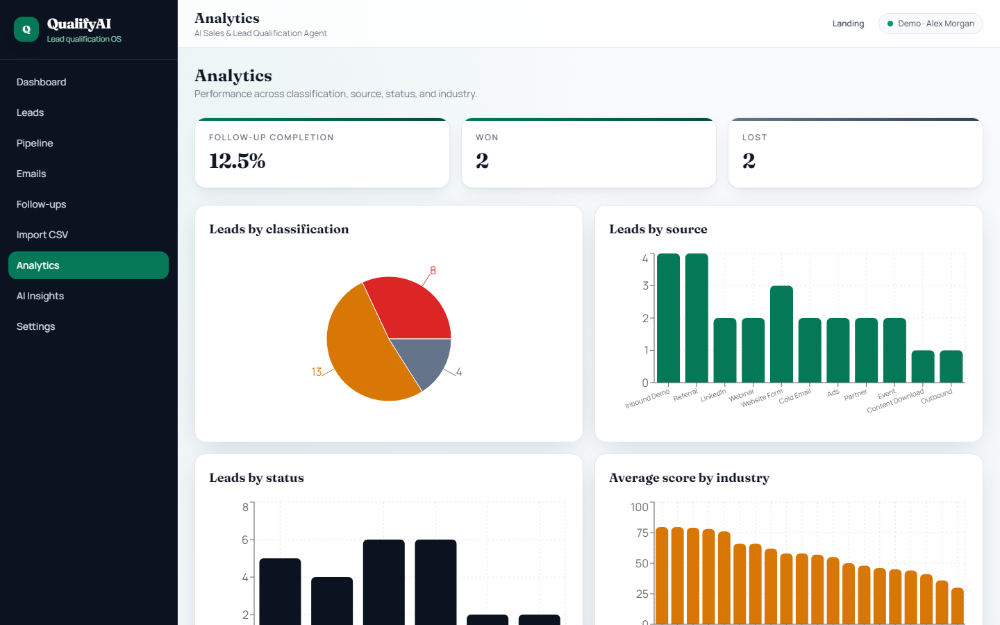
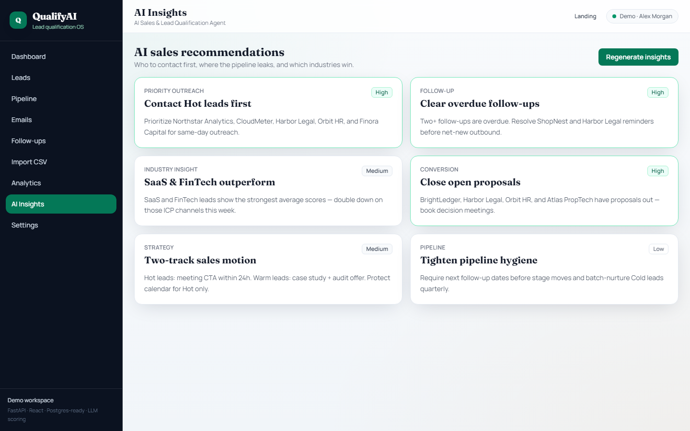

# AI Sales & Lead Qualification Agent

**Repo:** `ai-sales-lead-agent`  
**Product:** QualifyAI — an AI-powered sales assistant for startups and B2B teams.  
**Owner:** [Asif Fiaz](https://github.com/iamasiffiaz) · Sole author & maintainer

Qualify leads, score opportunities, generate personalized follow-up emails, manage a CRM-style pipeline, and prioritize the best prospects from one dashboard.

---

## Problem

Startups and sales teams receive leads from websites, forms, campaigns, LinkedIn, webinars, and cold outreach — then waste hours manually deciding which ones are valuable.

## Solution

This app uses a hybrid rules + AI qualification engine to score leads, classify them as **Hot / Warm / Cold**, suggest next actions, draft personalized outreach, track follow-ups, and visualize pipeline performance.

## Business Value

AI Sales & Lead Qualification Agent helps startups and sales teams prioritize the right leads, reduce manual qualification work, generate personalized outreach, and manage follow-ups from one dashboard. It improves sales productivity by helping teams focus on high-intent prospects and move faster through the pipeline.

---

## Screenshots

### Landing


### Dashboard


### Lead CRM


### Lead details + AI qualification


### Pipeline board


### Analytics


### AI recommendations


---

## Key Features

1. **Landing page** — modern SaaS hero, features, use cases, pricing, CTAs  
2. **Sales dashboard** — totals, Hot/Warm/Cold, average score, follow-ups, emails, charts  
3. **Lead CRM** — full CRUD, filters, search, sort, score badges  
4. **AI Lead Qualification Agent** — score, classification, intent, budget fit, urgency, next action  
5. **AI email drafts** — first outreach, follow-up, proposal, re-engagement, meeting request  
6. **Follow-up reminders** — upcoming / overdue, complete, generate AI follow-up email  
7. **CSV import** — bulk upload + optional AI scoring + import summary  
8. **CSV export** — lead + AI fields download  
9. **Pipeline board** — Kanban stages New → Won/Lost  
10. **Analytics** — classification, source, status, industry averages, won/lost  
11. **AI recommendations** — contact priority, follow-ups, industry, strategy, pipeline tips  
12. **Settings** — ICP, budget preference, follow-up interval, AI placeholders, signature  

---

## AI Lead Scoring Workflow

1. **Rules-based score** factors budget, urgency, industry fit, company size, decision-maker title, requirement clarity, source quality, and engagement notes.  
2. **Classification**
   - Hot: 75–100  
   - Warm: 45–74  
   - Cold: 1–44  
3. **AI enrichment** (OpenAI-compatible API when `OPENAI_API_KEY` is set) refines reasoning, next actions, and personalization.  
4. **Mock fallback** produces realistic business outputs when no API key is present — ideal for demos and portfolio screenshots.

---

## Tech Stack

| Layer | Stack |
|-------|--------|
| Frontend | React, Vite, Tailwind CSS, Axios, React Router, Recharts |
| Backend | FastAPI, SQLAlchemy, Pydantic, Python |
| Database | SQLite (local default) or PostgreSQL |
| AI | OpenAI-compatible chat API + mock fallback |
| Optional | Docker Compose (frontend, backend, Postgres) |

---

## Architecture

```
Browser (React SPA)
    │  REST / JSON
    ▼
FastAPI (routes → services → models)
    │
    ├── Lead scoring + AI service
    ├── CSV import/export
    ├── Email / follow-up / recommendations
    ▼
SQLite or PostgreSQL
```

---

## Use Cases

| Audience | How they use QualifyAI |
|----------|------------------------|
| **Startups** | Qualify inbound demos fast without hiring a full SDR pod on day one |
| **Agencies** | Run multi-client pipelines with consistent scoring and follow-up cadence |
| **Sales teams** | Focus calendar time on Hot leads; automate Warm nurture and Cold recycling |
| **B2B companies** | Turn form fills, webinars, and LinkedIn replies into prioritized opportunities |

---

## Folder Structure

```
ai-sales-lead-agent/
├── backend/
│   ├── main.py
│   ├── config.py
│   ├── database.py
│   ├── models.py
│   ├── schemas.py
│   ├── seed.py
│   ├── requirements.txt
│   ├── routes/
│   ├── services/
│   └── utils/
├── frontend/
│   ├── src/
│   │   ├── api/
│   │   ├── components/
│   │   ├── pages/
│   │   └── utils/
│   └── package.json
├── sample_leads.csv
├── docker-compose.yml
└── README.md
```

---

## Setup Instructions

### 1. Backend

```bash
cd backend
python -m venv .venv

# Windows
.venv\Scripts\activate

# macOS / Linux
source .venv/bin/activate

pip install -r requirements.txt
copy .env.example .env   # or: cp .env.example .env
python seed.py
uvicorn main:app --reload --port 8000
```

API docs: [http://localhost:8000/docs](http://localhost:8000/docs)

### 2. Frontend

```bash
cd frontend
npm install
copy .env.example .env   # VITE_API_URL=http://localhost:8000
npm run dev
```

App: [http://localhost:5173](http://localhost:5173)

### 3. Docker (optional)

```bash
docker compose up --build
```

- Frontend: http://localhost:3000  
- Backend: http://localhost:8000  
- Postgres: localhost:5432  

---

## Environment Variables

| Variable | Description | Default |
|----------|-------------|---------|
| `DATABASE_URL` | SQLAlchemy URL | `sqlite:///./leads.db` |
| `OPENAI_API_KEY` | Enables live AI (leave empty for mock mode) | empty |
| `OPENAI_BASE_URL` | Compatible API base | `https://api.openai.com/v1` |
| `CHAT_MODEL` | Chat model name | `gpt-4o-mini` |
| `JWT_SECRET` | Auth token secret | dev secret |
| `ACCESS_TOKEN_EXPIRE_MINUTES` | JWT lifetime | `1440` |
| `CORS_ORIGINS` | Allowed frontends | localhost:5173 |
| `DEBUG` | Verbose app mode | `true` |
| `VITE_API_URL` | Frontend API base | `http://localhost:8000` |

> Settings page fields (business name, ICP, signature) are stored in the database.  
> The live LLM key is read from **`OPENAI_API_KEY` in backend env**, not from the Settings form.

---

## API Endpoints

### Leads
- `GET /api/leads`
- `POST /api/leads`
- `GET /api/leads/{id}`
- `PUT /api/leads/{id}`
- `DELETE /api/leads/{id}`
- `POST /api/leads/import-csv`
- `GET /api/leads/export-csv`

### Qualification
- `POST /api/qualification/score/{lead_id}`
- `POST /api/qualification/bulk-score`
- `GET /api/qualification/{lead_id}`

### Emails
- `POST /api/emails/generate/{lead_id}`
- `GET /api/emails`
- `PUT /api/emails/{id}`
- `DELETE /api/emails/{id}`

### Follow-ups
- `GET /api/followups`
- `POST /api/followups`
- `PUT /api/followups/{id}`
- `DELETE /api/followups/{id}`

### Pipeline
- `GET /api/pipeline`
- `PUT /api/pipeline/move-lead/{lead_id}`

### Analytics
- `GET /api/analytics/dashboard`
- `GET /api/analytics/leads`
- `GET /api/analytics/pipeline`

### Recommendations
- `GET /api/recommendations`
- `POST /api/recommendations/generate`

### Settings, Auth & Health
- `GET /api/settings` · `PUT /api/settings`
- `POST /api/auth/register` · `POST /api/auth/login` · `GET /api/auth/me`
- `GET /api/health`

---

## Demo Workflow

1. Open the landing page → **Launch live demo**  
2. Review the **Dashboard** cards and charts  
3. Browse **Leads** — filter Hot scores, open a lead  
4. Click **Run AI score**, then **Generate** an email draft  
5. Move the lead on the **Pipeline** board  
6. Check **Follow-ups** for overdue reminders  
7. Import `sample_leads.csv` from the Import page  
8. Open **Analytics** and regenerate **AI Insights**  
9. Update ICP fields on **Settings**

**Demo login (seeded):** `demo@qualifyai.dev` / `demo1234`

Re-seed with a clean DB:

```bash
cd backend
python seed.py --force
```

---

## Future Improvements

- Real authentication with JWT session enforcement on protected routes  
- Stripe billing for Starter / Growth / Operator plans  
- Email sending integration (SMTP, Resend, or SendGrid)  
- CRM integrations — HubSpot and Salesforce sync  
- Team collaboration, seats, and role-based access  
- Webhook ingest from Typeform / Calendly / LinkedIn forms  
- Background job queue for bulk scoring at scale  
- Native drag-and-drop pipeline (dnd-kit)  
- Multi-tenant workspaces for agencies  
- Production deployment (Docker + managed Postgres + CDN) 

---

## Upwork Portfolio Case Study

Built and owned solely by **Asif Fiaz**.

This project demonstrates full-stack AI automation skills including AI lead scoring, CRM workflow design, CSV data import, sales pipeline management, AI-generated email drafts, follow-up automation, analytics dashboards, FastAPI backend development, React frontend development, PostgreSQL database design, and production-style SaaS architecture.

Ideal portfolio angles:

- AI automation for sales teams  
- Lead generation / qualification systems  
- Full-stack SaaS MVP delivery  
- Business growth tooling  

---

## Author

**Asif Fiaz** — sole owner, author, and maintainer of this repository.

- GitHub: [iamasiffiaz](https://github.com/iamasiffiaz)

---

## License

MIT License © Asif Fiaz

Use freely for portfolio, demos, and client proposals with attribution.
